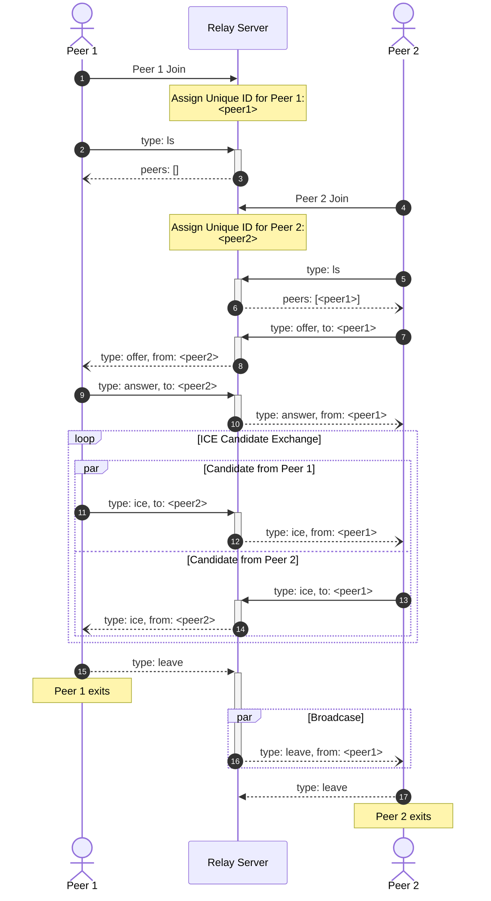

# Relay-WS

> [!WARNING] \
> This project is neither stable nor actively developed.

Simple and minimalistic WebRTC signalling server based on
WebSocket.

## How to use

### Docker

```sh
$ docker buildx build -t <tag> -o type=docker .
$ docker run -dp 34098:34098 <tag>
```

### Docker Compose

```sh
$ docker compose up -d
```

### Build manually

```sh
$ corepack enable
$ pnpm install
$ pnpm build
$ pnpm run start
```

## How relay server works



## Message table

### List

#### Request

| Name | Type   |
| ---- | ------ |
| type | `"ls"` |

#### Response

| Name  | Type   |
| ----- | ------ |
| type  | `"ls"` |
| peers | `ID[]` |

### Leave

#### Request

| Name | Type      |
| ---- | --------- |
| type | `"leave"` |

#### Response

| Name | Type      |
| ---- | --------- |
| type | `"leave"` |
| from | `ID`      |

### Offer

#### Request

| Name | Type      |
| ---- | --------- |
| type | `"offer"` |
| to   | `ID`      |
| sdp  | `string`  |

#### Response

| Name | Type      |
| ---- | --------- |
| type | `"offer"` |
| from | `ID`      |
| to   | `ID`      |
| sdp  | `string`  |

### Answer

#### Request

| Name | Type      |
| ---- | --------- |
| type | `"answer"` |
| to   | `ID`      |
| sdp  | `string`  |

#### Response

| Name | Type      |
| ---- | --------- |
| type | `"answer"` |
| from | `ID`      |
| to   | `ID`      |
| sdp  | `string`  |

### ICE candidate

#### Request

| Name | Type      |
| ---- | --------- |
| type | `"ice"` |
| to   | `ID`      |
| sdp  | `string`  |

#### Response

| Name | Type      |
| ---- | --------- |
| type | `"ice"` |
| from | `ID`      |
| to   | `ID`      |
| sdp  | `string`  |
